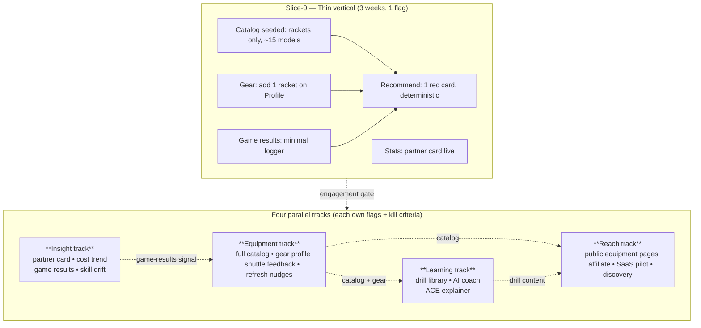

# BPM Badminton — Strategic Plan: Value-Hub Expansion

## Context

The app is a mature, single-club operations tool: sign-ups, waitlist, payments, settle workflow, attendance stats, ACE skills radar, bird inventory. The CLAUDE.md taxonomy is comprehensive at the **operations** layer.

The user's stated *ultimate goal* is broader than ops. It has four pillars the current code only gestures at:

1. **Value hub** for the recreational player (you open the app *between* sessions, not just to sign up).
2. **Enabled learning** (the app helps you get better, not just play).
3. **Admin cost-automation** (less mental load, more insight).
4. **Traffic / recommendations / insights** good enough to drive **equipment purchase suggestions**.

Today the only nod to (1)/(2)/(4) is the "Your equipment" coming-soon tile on Stats, the radar disclaimer linking to ACE, and the partner/cost coming-soon tiles. None are spec'd. (3) has good bones (Settle, Command Center, anomalies, burn-rate) but stops short of trend / forecast / drift detection.

This plan defines the work as **four parallel tracks + a thin-slice first delivery**, surfaces seven **required design decisions** with two options each + recommendation, and flags **eight not-yet-discussed concerns** the ultimate vision depends on.

---

## Shipping model — tracks, not phases

The roadmap's existing phase model (P0 → P1 → P1.5/1.6/1.7/1.8 → P2 → P3 → P4) **already broke in flight** — every `.5`/`.6`/`.7`/`.8` was a mid-phase rescue. Three reasons phases don't fit the next stage:

1. The flag registry + `plannedRemoval` already enable continuous trunk shipping. Phases are decorative on top of it.
2. The remaining vision is cross-cutting (data → insight → recs → reach), not stacked — foundation built without a vertical slice consuming it goes stale.
3. Engagement is uncertain. "Will For-you cards work?" is a build-measure-decide loop, not a phase-tag commitment.

**Replacement model:**
- **Four tracks** run in parallel, each with its own flags and a written kill criterion. No ordering between tracks beyond data dependencies.
- **Thin vertical slice first.** Before fanning out, ship one end-to-end racket-only slice that touches every track. If engagement is dead, kill it cheap. If alive, fan out.
- **`bpm-stable` tags become narrative checkpoints, not gates.** Tag when a coherent story is ready to tell friends; no track has to wait for another to tag.

The dependency chain stays **data → insight → recommendation → reach**, but tracks ship continuously rather than gated as phase bundles. Slice-0 exists so the dependencies are validated end-to-end before any track fans out.

---

## Slice-0 — The thin vertical (ship first, ~3 weeks, one flag `NEXT_PUBLIC_FLAG_VALUE_HUB_SLICE`)

Goal: prove the whole chain end-to-end before fanning out into tracks. Built cheap; killed cheap if dead.

**Minimum scope** — every box in the diagram, but narrow:
- Catalog seeded with **rackets only** (~15 models — top 5 each from Yonex / Victor / Li-Ning). Hand-curated; no admin UI yet.
- Gear: a single "What's your racket?" question on Profile, picks from the seeded list.
- Game results: a 30-second "Log Thursday" sheet that appears in Stats for 48h post-session — `you` vs `partner`, won/lost, score (text). No per-court bracket; just three taps.
- Recommend: one card on Profile ("Players at your stage often use…"). Deterministic: filter catalog by `member.stage`, weight by recent games-played count, return top 1. No AI yet.
- Stats: ship the Partner-frequency card alongside (same data signal feeds the rec).

**Kill criterion** (writes-down-front, decides-with-data): after 4 weeks live on `bpm-next` with 6+ friends dogfooding — if <40% of dogfoorders interact with the rec card more than once, and <30% log a game, the slice is killed. The catalog seed stays (cheap), everything else is reverted. Tracks below don't start.

**Survives** → tracks fan out as designed below.

---

## Track 1 — Insight

**Cards to ship on Stats tab** (extend existing `StatsPlaceholder` slot pattern):
- **Partner frequency**: who you played with most over last 12 weeks. Pulls from `players` rows grouped by `sessionId`, intersects with the viewing user. New file `components/stats/cards/PartnerFrequencyCard.tsx`. New API `GET /api/stats/partners?name=X&weeks=N`. Mirrors `AttendanceCardLive` identity-resolution chain (`badminton_identity` → `badminton_stats_preview_name` → picker).
- **Cost trend**: per-person cost over last 12 sessions, sparkline + delta. New `GET /api/stats/cost-trend?name=X`. Sources from `session.settled.costPerPerson` (preferred) falling back to live compute. Reuses `lib/fmt.ts` formatters.
- **Game results** (NEW): admin or self-report log of game outcomes after a session — small sheet at end of session ("Log tonight's games"). New container `gameResults` (PK `/sessionId`); schema `{ id, sessionId, courtNumber, teamA: string[], teamB: string[], scoreA, scoreB, loggedBy }`. This is the **most important new signal** — without win/loss data, the recommender, smart matchmaking, and skill validation all stay aspirational. Optional; off by default; ships behind `NEXT_PUBLIC_FLAG_GAME_RESULTS`.

**Admin extensions to Command Center**:
- **Spend-forecast card**: extends `BirdInventoryCard` runway logic to also forecast cost-per-player drift if court prices held + bird burn rate continued. New `GET /api/admin/forecast`.
- **Skill-drift anomaly**: extend `lib/anomalies.ts` with a `skill_unrated_long` code (player attended N+ sessions, never rated). Plumbs through existing `AnomalyFeed`.

**Files to add / touch**:
- `lib/types.ts` — add `GameResult` interface
- `lib/cosmos.ts` — register `gameResults` container with `ensureContainer('gameResults', '/sessionId')`
- `app/api/stats/partners/route.ts`, `app/api/stats/cost-trend/route.ts`, `app/api/games/route.ts`
- `components/stats/cards/PartnerFrequencyCard.tsx`, `CostTrendCard.tsx`, `GameResultsLogger.tsx`
- `lib/flags.ts` — register `NEXT_PUBLIC_FLAG_GAME_RESULTS`, `NEXT_PUBLIC_FLAG_PARTNERS_CARD`, `NEXT_PUBLIC_FLAG_COST_TREND`
- `lib/anomalies.ts` — add `skill_unrated_long` to `AnomalyCode` union (typed-narrow per CLAUDE.md rule)

Verify: with mock store seeded via `SEED_DEV_SCENARIO=fresh-thursday`, sign up, advance through 6+ sessions logging games each time; confirm cards populate with non-empty data and the "lying empty state" guard renders distinct loaded-empty vs. load-failed (per CLAUDE.md rule). Unit-test partner aggregation as pure function with multi-week mock data.

**Kill criterion**: if partner card has <50% open rate after 4 weeks, retire it. Cost-trend stays regardless (admin uses it). Game-results flag stays on if log-rate >25%.

---

## Track 2 — Equipment

Goal: collect the data the recommender will reason over. No recommendations yet — that's P7. Without this stage the existing "Your equipment" Stats tile stays vapor.

**New schema** (additive, optional, per CLAUDE.md schema rule):
- Container `equipmentCatalog` (PK `/category`) — global, admin-curated. `{ id, category: 'racket'|'string'|'shoe'|'shuttle'|'bag'|'grip', brand, model, msrp, skillRange: [stage, stage], attributes: {...}, sources: [{retailer, url, affiliateTag?}] }`. Seeded with ~50 popular models per category (Yonex Astrox/Nanoflare/Arcsaber, Victor Thruster/Auraspeed, Li-Ning Aeronaut/AxForce, common strings BG65/BG80/Aerosonic, common shoes 65Z3/PowerCushion etc.).
- Container `playerGear` (PK `/memberId`) — per-player. `{ id, memberId, items: [{catalogId, category, acquiredAt, retiredAt?, tensionLbs?, notes?}], stringLog: [{at, tensionLbs, type}], shoesMileage: { sessionsLogged } }`.

**Player surface** — new collapsible section in `ProfileTab.tsx` ("My gear"), opens a `<GearSheet>` (uses `BottomSheet` primitive per CLAUDE.md rule). Search-autocomplete picks catalog items. Free-text "Other" allowed; admin curates promotion to catalog later.

**Shuttle feedback** — extend `BirdPurchase` UI in `BirdInventoryCard.tsx` to surface the existing `qualityRating` field as a 5-star picker after every session. Aggregates feed a "club shuttle preference" admin insight, and (P7) shuttle recommendations.

**Files to add / touch**:
- `lib/types.ts` — `CatalogItem`, `GearItem`, `PlayerGear`
- `lib/cosmos.ts` — register both containers
- `app/api/equipment/catalog/route.ts` — public GET (search), admin POST/PATCH/DELETE
- `app/api/equipment/gear/route.ts` — self-only via `memberId` match, public read of summary
- `components/profile/GearSheet.tsx` (new dir, mirrors `components/home/`)
- Seed script `scripts/seed-equipment-catalog.mjs` for the 50-model bootstrap

Verify: seed catalog locally with `node scripts/seed-equipment-catalog.mjs`, add a racket/string/shoe to a test member, confirm round-trip via API + UI; PATCH retire timestamp; assert `pinHash` and `deleteToken` strip-canary on the new player-facing endpoints.

**Kill criterion**: if <40% of active members log any gear within 4 weeks of launch, freeze the track at racket-only and don't expand to strings/shoes/grip. Catalog stays (cheap), expansion is deferred.

---

## Track 3 — Learning + Recommendation

Goal: the value-hub-on-steroids stage. This is where retention happens — players open the app between sessions.

**Recommendation engine** — produces three card types on a new Profile sub-section ("For you"):
1. **"You might like" — equipment**: filters `equipmentCatalog` by `skillRange` overlapping `member.stage`, weighted by recent game-results outcomes, current gear age, club shuttle pref. Returns 3 items.
2. **"Time for new strings / shoes"** — refresh nudges based on `playerGear.stringLog` last entry > 6 months or sessions since shoe acquired > 80.
3. **"Try this drill"** — surfaces from drill library (below), targeting the player's lowest ACE dimension.

**Learning surface** — new tab? **No.** Embed into existing Stats tab as a fourth card group ("Improve"), keeping the 4-tab nav (CLAUDE.md says tab count is locked at 4). Drills tied to ACE dimensions; each drill is `{ id, aceDimension, minStage, title, body, videoUrl?, durationMin }`. Source: ~30 curated drills covering all 7 ACE dimensions.

**AI coach** — admin-only at first (cost guardrail); button on each drill card ("Ask Coach about this"). Reuses existing `/api/claude` rate-limit pattern, system prompt seeded with the user's ACE scores + last 5 game results. Opt-in via flag.

**Files**:
- Container `drills` (PK `/aceDimension`) — admin-managed
- `app/api/recommend/route.ts` — single entry point, returns mixed card list
- `app/api/drills/route.ts` — public GET, admin write
- `components/profile/ForYouSection.tsx`, `components/stats/cards/DrillSuggestionCard.tsx`
- `lib/recommend.ts` — pure scoring function (testable; given member + gear + results + catalog, return ranked items)

Verify: unit-test `lib/recommend.ts` with synthetic members at stages 1/3/5 — assert (a) catalog items returned all overlap stage, (b) refresh-nudge fires at the right thresholds, (c) drill suggestion targets the **lowest** dimension. Smoke-test AI coach Claude call with one question; confirm rate-limit hits at 10/min per CLAUDE.md pattern.

**Kill criterion**: For-you card needs >50% open rate in week 1; AI coach needs >20% of admin try-rate in month 1. Drills can stay regardless (cheap content).

---

## Track 4 — Reach (decided later, sketch only)

Once value-hub is real, two reach plays unlock:
- **Public landing pages**: equipment review pages indexable by Google ("Best stringing tension for intermediate players"). Lives at `/bpm/equipment/<slug>` — admin-curated content, SEO-tuned, links into the catalog. Drives organic traffic.
- **Affiliate / SaaS pilot**: see decision D below. Decided once we have 3+ months of recommendation engagement data to know if click-throughs convert.

Not designed in this plan — listed so the dependency from the prior tracks is visible. Track 4 only opens after Tracks 2 + 3 survive their kill gates.

---

## Required Design Decisions (2 options each)

### Decision A — Equipment data shape

| | Option A1: Free-text on Member | Option A2: First-class catalog + gear containers |
|---|---|---|
| Pros | Ships in a day. Zero migration. Low friction for player. | Enables recommender. Searchable, normalized. Brand/model agree across players. SEO-able. |
| Cons | Recommender becomes a string-similarity problem. No taste graph. Dead end. | Two containers + seed script. ~1 sprint. Schema discipline required. |

**Recommendation: A2.** A1 is a trap — without normalized brand/model you can't filter by skill range, can't surface "players like you also use," can't make the equipment landing pages SEO-able. The cost is real but the engineering is mechanical (mirrors `birds` container pattern).

### Decision B — Recommendation engine

| | Option B1: LLM-driven (Claude) | Option B2: Rule-based scoring (deterministic) |
|---|---|---|
| Pros | Handles fuzzy context. Personalized explanations ("This racket because your overhead is your weakest dimension and you play 3×/week"). Easy to evolve. | Predictable. Free (no token cost). Testable. Auditable. Cold-start friendly. |
| Cons | Per-request cost. Cold-start latency. Hallucination risk on niche brands. Hard to A/B. | Brittle to edge cases. Recs feel formulaic. Worse for narrative explanations. |

**Recommendation: B2 as the engine, B1 as the explainer.** Score deterministically in `lib/recommend.ts` (testable), then optionally pass top-3 + member context to Claude *only for the natural-language reason* shown on the card. Best of both: cheap + explainable. Mirrors the receipt-export pattern (deterministic template, Claude only for polish).

### Decision C — Game-result data collection

| | Option C1: Optional post-session sheet | Option C2: Real-time admin scoring at venue |
|---|---|---|
| Pros | Low friction. Players opt in. No admin burden. | Higher data quality. Real timestamps. Catches rotation patterns. |
| Cons | Sparse data. Selection bias (winners log more). Drops off fast. | Massive admin burden — defeats P3 (admin cost relief). |

**Recommendation: C1 with a gamified nudge.** Players log their own games via a sheet that appears in Stats for 48h after a session they attended ("How did Thursday go?"). Sparse data is fine — the skill-drift detector only needs ~10 games to fire a signal. Don't add admin work; that breaks pillar 3.

### Decision D — Monetization

| | Option D1: Affiliate links to retailers | Option D2: No monetization (trust capital) |
|---|---|---|
| Pros | Funds API costs + Azure bill. Aligned: better recs → more revenue. Standard practice. | Pure trust signal. No "you're recommending this because you get paid" doubt. Simpler legal. |
| Cons | Disclosure obligations (FTC/Canadian Competition Bureau). Risk recs feel salesy. Tax overhead. | App stays a cost center. Burnout risk if it succeeds. |

**Recommendation: D1, but only after P7 has 3 months of engagement data, and only with explicit disclosure on every recommendation card.** The catalog schema includes `sources: [{retailer, url, affiliateTag?}]` for exactly this — the field can be `null` for the entire P7 launch and flipped on later without schema migration. Defer the decision; design for it.

### Decision E — Smart matchmaking algorithm

| | Option E1: Claude-balanced courts | Option E2: Deterministic skill-variance minimization |
|---|---|---|
| Pros | Considers chemistry, recent partners, "give X a shot at a court above their level tonight." Surprise + delight. | Predictable. Fast. Free. Works offline. Easy to test. |
| Cons | Latency per recompute. Token cost. Hard to defend "why am I on this court?" answer. | Misses social dynamics. Optimal-on-paper but boring. |

**Recommendation: E2 as the spine, E1 as a "shuffle suggestion" button.** Same pattern as decision B — deterministic ranking that admin can re-roll once via Claude for a "fresh shuffle" if the room dynamics feel stale. Punts the cost question per-session, not per-court.

### Decision F — Reach / public surface

| | Option F1: Open the value-hub publicly | Option F2: Stay invite-only |
|---|---|---|
| Pros | Equipment pages drive SEO. Drill library is shareable. Recommendations seed virality. Aligns with "gather traffic." | Existing trust model. No moderation burden. Friend-group voice intact. |
| Cons | Need a marketing landing. Spam risk on UGC (drill comments etc.). Brand surface widens. | Cap on growth. The "traffic" pillar can't be hit. |

**Recommendation: F1 — but only the equipment + drills surfaces public; sessions/payments/players stay invite-only.** Split the app into two registers under the same `/bpm` base path: `/bpm/equipment/*` and `/bpm/learn/*` are server-rendered, no auth, SEO-tuned; everything else stays as today. This honors the friend-group privacy promise while opening the value-hub for indexability.

---

## Things not yet discussed (matters for the ultimate vision)

1. **Game results / win-loss data** — covered in P5 above. This is the single most-leveraged missing signal; without it, skill ratings don't validate, recommender can't learn, smart matchmaking is impossible. Listing it again here because of how foundational it is.

2. **Skill-rating drift / decay** — admin sets a stage once and it never updates. Real players plateau, regress, surge. Need either (a) periodic re-rate prompts on admin, (b) implicit drift from game results, or (c) peer assessment (already in P3 roadmap). Recommend (b) once games log fills.

3. **Injuries / fitness / age** — relevant to shoe + knee-brace recommendations, also to session-load nudges ("you've played 4× this week"). Sensitive data; opt-in only, never displayed to admin in identifiable form. Could be a Profile self-report toggle.

4. **String tension log + decay nudges** — strings lose tension at ~1 lb/week even unplayed. The refresh nudge in P7 sketches this; needs `stringLog` per-entry in `playerGear`. High-affinity signal (advanced players care about this *a lot*).

5. **Court / venue booking integration** — every admin currently coordinates court bookings out-of-band (Sportplus, ActiveNet, venue email). Pulling availability in would 10× admin relief. Big API integration; defer until SaaS pilot has 2+ venues asking.

6. **Tournament + drop-in discovery** — local tournament calendar, drop-in club listings. Lives at `/bpm/discover/*` (public, SEO). Distinct from the in-app session-scheduling — this is *finding* play, not running it. Probably a P9 or its own track.

7. **Privacy / data export / GDPR-PIPEDA posture** — once we collect gear + game results + AI conversation history, this is no longer just "friend chat." Need a `GET /api/me/export` (full JSON dump), a delete-my-account flow, and a privacy page. Required if SaaS pitch is real.

8. **Coaching marketplace** — local coaches list profiles, players book sessions. Adjacent to drills + AI coach; potentially the highest-value monetization (not affiliate-thin). Probably a P10; flagged here so the catalog/gear schema doesn't paint us into a corner (it doesn't — coach is just another `category`-like top-level container).

Other smaller things noticed: there's **no in-app feedback channel** other than the GitHub issue link in PreviewBanner (which only shows on `next`). For non-technical friends a "Send admin a quick note" path on Profile would close that loop. Also, **no notification surface** (push or email) — every interaction is poll-driven. If a player gets bumped off the waitlist into the active roster, they don't know unless they reopen the app. Web Push notifications are tractable on the existing Next.js setup; worth a separate small spike before P5.

---

## Decision G — Shipping model itself

| | Option G1: Keep phases (status quo) | Option G2: Tracks + thin slice (this plan) |
|---|---|---|
| Pros | Familiar. Existing changelog narrative. Tag-promotion runbook unchanged. | Matches the real ship cadence (already small-PR + flag). No artificial bundling. Engagement-driven kill gates protect against build-then-no-users. Tracks ship in parallel. |
| Cons | Phases keep breaking — P1.5/1.6/1.7/1.8 are evidence. Pretends destination is known; pillar (1) (value hub) has real uncertainty. | New mental model for changelog narrative. Tracks need explicit kill criteria written up-front (extra discipline). |

**Recommendation: G2** — but keep `bpm-stable-vX.Y` tags as narrative checkpoints. When a track ships something coherent enough to tell friends about, cut a tag. The runbook (`docs/deployment-model.md`) keeps working; only the planning frame changes.

---

## Track summary + verification

| Track | Scope | Kill criterion (decide-with-data) |
|---|---|---|
| Slice-0 | One-flag thin vertical: racket catalog + gear pick + 1 rec + game log + partner card | 4 weeks live, ≥40% interact with rec card more than once AND ≥30% log a game |
| 1 — Insight | Partner card, cost trend, game results, skill drift signal, admin forecast | Partner card open rate ≥50% in 4 weeks; cost trend + admin forecast stay regardless |
| 2 — Equipment | Full catalog (rackets→strings→shoes), gear log, shuttle feedback, refresh nudges | ≥40% of active members log any gear within 4 weeks |
| 3 — Learning | Drill library, For-you card, AI coach (admin-only) | For-you open rate ≥50% week 1; AI coach admin try-rate ≥20% month 1 |
| 4 — Reach | Public equipment pages, affiliate, SaaS pilot, discovery | Gated on Tracks 2 + 3 surviving; defined when triggered |

Each track ships behind feature flags per the CLAUDE.md retirement rule (every flag carries `plannedRemoval` two weeks after stable promotion). Tests required for both `on` and `off` branches of any meaningful flag, per existing pattern.

End-to-end smoke per track: `SEED_DEV_SCENARIO=fresh-thursday` → advance 6 sessions, log games, rate shuttles, add gear, hit "For you" — all on the mock store, then repeat against real Cosmos in `bpm-next` before any stable tag. Tag cut when a track's story is friend-tellable, not when the track is "done."
