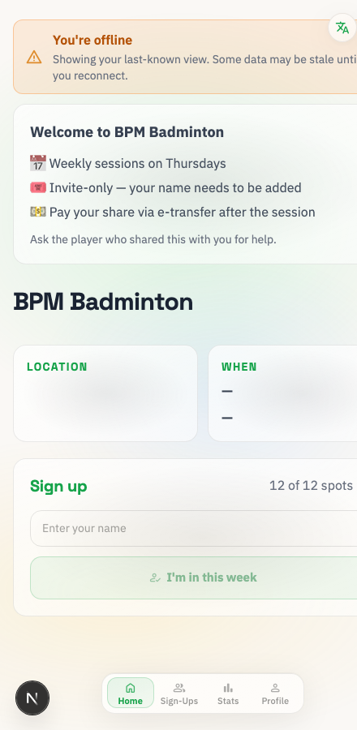
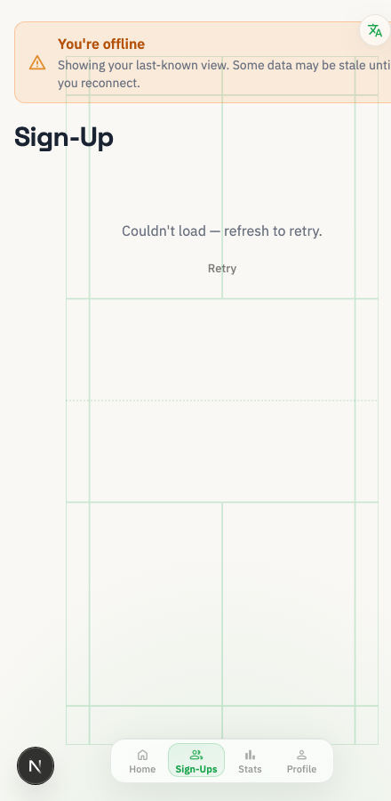
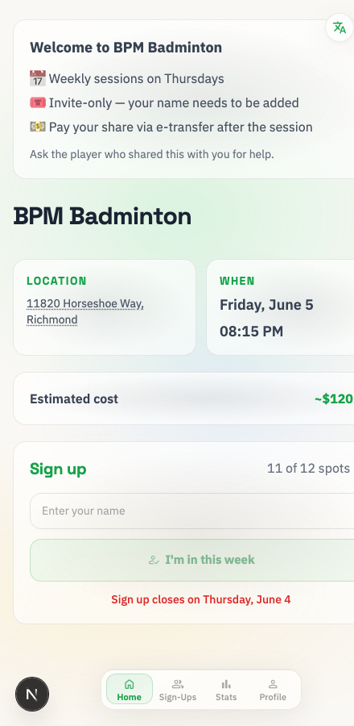

# Run-skill verification — the `NEXT_PUBLIC_BASE_PATH` gotcha

Visual evidence captured while building and verifying
[`.claude/skills/run-badminton-app`](../../.claude/skills/run-badminton-app/)
(2026-06-04). All three are the offline mock-store launch (no Cosmos, no prod
data) — they differ only by whether `NEXT_PUBLIC_BASE_PATH=/bpm` was set.

## The gotcha

`next.config.js` sets `basePath: '/bpm'` **server-side only** — it does not
export the env var. The client bundle reads `BASE = process.env.NEXT_PUBLIC_BASE_PATH || ''`.
If that var is unset, every client fetch goes to `/api/*` (no prefix) → 404 →
`reportFetchFailure` cascades into a **false, app-wide "You're offline" state**
even though the server is perfectly healthy.

## Before — basePath unset

| Home | Sign-Ups |
|---|---|
|  |  |

"You're offline" banner; LOCATION/WHEN blank; "12 of 12 spots" (default, not
the real count); Sign-Ups shows "Couldn't load — refresh to retry." The server
was fine — only the client's fetch prefix was wrong.

## After — `NEXT_PUBLIC_BASE_PATH=/bpm`

Live seeded data loads (location, session time, estimated cost, real spot
count) and the offline banner is gone.

## Fix

`.env.local.example` now ships `NEXT_PUBLIC_BASE_PATH=/bpm`, so
`cp .env.local.example .env.local` yields a working offline config. The run
skill's `smoke.sh` also passes it inline, so it works on a bare clone with no
`.env.local` at all. Verified from a fresh `git clone` + `cp` + bare
`npm run dev`.
